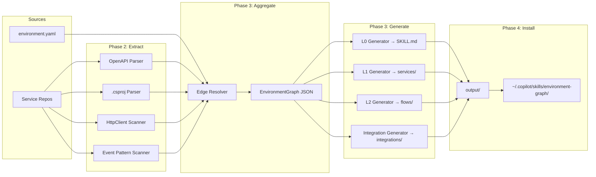

# Environment Graph: Implementation Plan

## 1. Overview

A pre-computed, globally-installed Copilot skill package that gives every developer in every service repo full visibility into the system topology — which services exist, what they expose, how they connect, and where the integration seams are. Without MCP, the only way to get cross-repo context into Copilot is to pre-compute it and deliver it as static reference files. The skill is generated by extraction scripts that clone and analyze all service repos, then installed globally via `install.mjs` so no per-repo config is needed. Developers run one command to update; CI keeps the graph fresh automatically.

This plan supports two delivery tracks that share the same extraction pipeline (Phases 1–3): **Track A (Static)** ships pre-computed skill files immediately, requires no org approval, and works today. **Track B (MCP)** adds a runtime query server for better token efficiency and arbitrary graph queries, but requires MCP to be enabled by the org. Track A ships first; Track B is a drop-in upgrade when MCP is approved — the extraction pipeline output doesn't change, only how agents consume it.

---

## 2. Architecture

### Tiered Context Model

| Tier | File                            | Token Budget      | Load Trigger         | Content                                            |
| ---- | ------------------------------- | ----------------- | -------------------- | -------------------------------------------------- |
| L0   | `SKILL.md` body                 | ~500–800          | Skill invoked        | All services, adjacency list, integration points   |
| L1   | `references/services/<name>.md` | ~1–2K per service | `read_file` by agent | Single service: endpoints, deps, contracts, events |
| L2   | `references/flows/<name>.md`    | ~1–2K per flow    | `read_file` by agent | End-to-end business flow across services           |
| L3   | OpenAPI specs in service repos  | Unbounded         | Explicit checkout    | Full API detail — already exists, not regenerated  |

Frontmatter is scanned during discovery at ~200–400 bytes. The L0 body only loads when the skill is matched. L1/L2 only load when the agent explicitly calls `read_file`.

### Output Directory Structure

```
output/
├── SKILL.md                              # Skill entry point + L0 environment map
└── references/
    ├── services/
    │   ├── order-import-api.md           # L1 — order intake from TikTok/Shopify
    │   ├── order-processing-api.md       # L1 — routing, mapping, status management
    │   ├── asset-generation-api.md       # L1 — image/file generation for fulfillment
    │   ├── engraving-station-api.md      # L1 — station-facing engraving workflow
    │   ├── quality-station-api.md        # L1 — QC inspection station workflow
    │   ├── contracts-package.md          # L1 — shared NuGet contracts (DTOs, events)
    │   └── boomi-integration-api.md      # L1 — Boomi orchestration surface
    ├── flows/
    │   ├── order-lifecycle.md            # L2 — TikTok/Shopify → processing → SAP
    │   ├── asset-generation-flow.md      # L2 — order confirmed → assets ready
    │   ├── quality-inspection-flow.md    # L2 — station scan → QC pass/fail → SAP
    │   └── engraving-workflow.md         # L2 — station assignment → completion
    ├── integrations/
    │   ├── sap.md                        # External: SAP endpoints, auth, data shapes
    │   ├── tiktok-shop.md                # External: TikTok Shop webhook/API surface
    │   ├── shopify.md                    # External: Shopify webhooks, GraphQL
    │   ├── boomi.md                      # Platform: Boomi flows, process names
    │   └── manufacturing-facility.md    # External: facility system protocols
    └── models/
        ├── order.md                      # Shared domain model: Order, LineItem, Status
        ├── product.md                    # Product, SKU, CustomizationSpec
        └── asset.md                      # Asset, GenerationRequest, AssetType
```

### Generation Pipeline



### How Agents Consume It

Working in the Quality Station repo:

1. Copilot scans `SKILL.md` frontmatter → ~300 bytes, always cheap
2. Cross-service question → agent reads `SKILL.md` body → L0 map (~600 tokens)
3. Quality Station specifics → reads `references/services/quality-station-api.md` (~1.5K tokens)
4. Full inspection flow → reads `references/flows/quality-inspection-flow.md` (~1.5K tokens)
5. SAP writeback details → reads `references/integrations/sap.md`
6. Need full API contracts → reads OpenAPI spec in the target service's local clone

Total cost for a well-scoped cross-service task: ~4–5K tokens of graph context.

---

## 3. Delivery Track Comparison

### Token Efficiency Comparison

| Scenario                                    | Track A (Static)                                               | Track B (MCP)                                       |
| ------------------------------------------- | -------------------------------------------------------------- | --------------------------------------------------- |
| "What does quality-station-api call?"       | Read SKILL.md body (~600 tokens) + service ref (~1500) = ~2100 | `get_service("quality-station-api")` → ~200 tokens  |
| "Trace order from TikTok to SAP"            | Read SKILL.md (~600) + flow ref (~1500) = ~2100                | `trace_path("tiktok-shop", "sap")` → ~400 tokens    |
| "Which service publishes InspectionFailed?" | Read SKILL.md + scan multiple service refs = ~3000+            | `query("InspectionFailed publisher")` → ~150 tokens |
| Full cross-service investigation            | ~4–5K tokens                                                   | ~1–2K tokens (multiple targeted queries)            |

### Trade-off Summary

| Dimension                                 | Track A (Static)                             | Track B (MCP)                          |
| ----------------------------------------- | -------------------------------------------- | -------------------------------------- |
| Org approval needed                       | No                                           | Yes (MCP enablement)                   |
| Token efficiency                          | Good (tiered loading)                        | Excellent (surgical queries)           |
| Query flexibility                         | Fixed views only                             | Arbitrary graph queries                |
| Freshness                                 | Stale between rebuilds                       | Can check age, warn, or re-extract     |
| Setup complexity                          | Low (install files)                          | Medium (run server process)            |
| Auto-context (knows which repo you're in) | No — agent must figure out which ref to read | Yes — server detects workspace context |
| Offline capability                        | Full (files are local)                       | Requires server running                |

### Recommendation

Start with Track A — it ships immediately and provides substantial value. Build Track B in parallel or as a fast-follow. When MCP is approved, Track B becomes the primary consumption path and Track A files become the fallback/offline mode.

---

## 4. Phased Implementation Plan

### Phase 1: Environment Topology Bootstrap

**Deliverable:** Repo with typed schema + hand-authored `environment.yaml` as ground truth

1. Create `environment-graph` repo (private, same GitHub org)
2. Initialize with `package.json`, TypeScript config, `src/` and `output/` dirs
3. Define TypeScript interfaces for the graph schema (see Section 5)
4. Write `environment.yaml` — list all known services, their repos, integrations, and rough relationships
   - This is the bootstrap; extraction will validate/enrich it later
   - Include: all 10–20 service repos, SAP, TikTok Shop, Shopify, Boomi, manufacturing facility
5. Add `validate-schema.ts` — loads `environment.yaml`, checks against TypeScript types, reports gaps
6. Add `install.mjs` — copies `output/` to `~/.copilot/skills/environment-graph/`
7. Write placeholder `output/SKILL.md` to prove install works end-to-end

**Key decisions:**

- Which repos are in GitHub vs ADO? (affects clone auth in Phase 5)
- Event/messaging infrastructure: MassTransit? Azure Service Bus directly? RabbitMQ? Scan strategy depends on this.
- Shared Contracts package name(s) — needed for .csproj scanner pattern

**Dependencies:** None — this is the foundation everything builds on

---

### Phase 2: Service Extraction Scripts

**Deliverable:** Scripts that extract a `ServiceGraph` JSON fragment from a single service repo path

1. `src/extractors/openapi.ts` — locate `swagger.json`/`openapi.yaml` in the repo, parse endpoints, DTOs, response shapes; output: `{ endpoints: Endpoint[], schemas: Schema[] }`
2. `src/extractors/csproj.ts` — parse all `.csproj` files; extract NuGet `PackageReference` entries; flag shared Contracts packages; output: `{ packages: string[], contractRefs: string[] }`
3. `src/extractors/httpclient.ts` — scan `*.cs` for `AddHttpClient<T>`, `AddRefitClient<T>`, `HttpClient` constructor injection; resolve `T` to a service name via the Contracts package or naming convention; output: `{ outboundCalls: ServiceCallRef[] }`
4. `src/extractors/events.ts` — scan for MassTransit consumers (`IConsumer<T>`), publishers (`IBus.Publish`, `ISendEndpointProvider`), Azure Service Bus SDK patterns; output: `{ publishes: EventRef[], consumes: EventRef[] }`
5. `src/extractors/index.ts` — orchestrates all four extractors for a given repo path; merges into `ServiceGraph` fragment
6. `src/run-extract.ts` — CLI entry point: `npx ts-node src/run-extract.ts --repo /path/to/service --output fragments/service-name.json`
7. Write extraction tests against a fixture directory with sample `.csproj`, OpenAPI, and `.cs` files

**Key decisions:**

- Do service repos have consistent OpenAPI spec file locations? Establish convention or make scanner configurable.
- Refit vs raw HttpClient vs typed `IServiceClient` — scanner needs to handle all variants the team uses.
- MassTransit version — v7 and v8 have different consumer registration patterns.

**Dependencies:** Phase 1 graph schema (TypeScript types for `ServiceGraph`)

---

### Phase 3: Graph Aggregation + Tier Generation

**Deliverable:** Full pipeline from raw repos to installable skill package

**Aggregation:**

1. `src/aggregate.ts` — reads all `fragments/*.json`; merges into unified `EnvironmentGraph`
2. Edge resolver — matches outbound `ServiceCallRef` (from `httpclient.ts`) to inbound service names; creates `calls` edges
3. Event edge resolver — matches `publishes` events to `consumes` events across fragments; creates `publishes`/`subscribes` edges
4. Contract edge resolver — matches shared Contracts package references across services; creates `shares_contract` edges
5. Conflict detection — flag where `environment.yaml` ground truth contradicts extracted data; print warnings, don't fail

**Tier Generators:**

6. `src/generators/l0.ts` — generates `output/SKILL.md` with environment map table, adjacency list, integration index; enforce ≤ 800-token budget (warn if exceeded)
7. `src/generators/l1.ts` — generates one file per service under `output/references/services/`; enforce ≤ 2K-token budget per file
8. `src/generators/l2.ts` — generates flow files under `output/references/flows/`; these are partially template-driven — extraction can populate the services involved, but narrative descriptions require manual authoring (Phase 6)
9. `src/generators/integrations.ts` — generates `output/references/integrations/` files from `environment.yaml` integration nodes (mostly hand-authored data)
10. `src/generators/models.ts` — generates `output/references/models/` from shared Contracts package schemas
11. `src/build.ts` — master pipeline: extract all repos → aggregate → generate all tiers → write `output/`
12. Token budget validator — after generation, scan each output file, compute token estimate, warn on overrun

**Key decisions:**

- L2 flow files: how much do you want auto-generated vs manually maintained? Recommend: auto-populate service list and data transformation sections; manually write the narrative prose.
- `environment.yaml` wins on conflict (ground truth) or extraction wins? Recommend: extraction wins for structural data, `environment.yaml` wins for narrative descriptions.

**Dependencies:** Phase 2 extractors

---

### Phase 4A: Static Delivery (Track A)

**Deliverable:** One-command install, documented for team

1. Finalize `install.mjs` — copies `output/` to `~/.copilot/skills/environment-graph/`; prints confirmation with service count and generation timestamp
2. Add `package.json` scripts:
   - `"extract"` — runs extraction against all configured repo paths
   - `"build"` — runs aggregate + generate (assumes fragments already exist)
   - `"full-build"` — extract + build
   - `"install"` — copies output to global skill location
   - `"update"` — full-build + install in one command
3. Write `README.md` for the team covering: prerequisites, initial setup (clone all service repos), run `npm run update`, VS Code restart not required (skill files are read dynamically)
4. Add `config.json` or `.env` — map service names to local repo paths; devs configure this once on their machine
5. Consider: `postinstall` hook in npm that auto-runs install after `npm install` in this repo
6. Consider: shell alias `graph-update` that `cd`s to the environment-graph repo and runs `npm run update`
7. Test: have one other developer follow the README from scratch and time how long it takes

**Key decisions:**

- Local repo paths will differ per developer — `config.json` vs `.env` vs `repos.local.json` (gitignored). Recommend: `repos.local.json` gitignored + `repos.example.json` committed.
- Pull-before-extract: should the build script `git pull` each service repo before extracting? Yes, but make it optional with a `--skip-pull` flag.

**Dependencies:** Phase 3 build pipeline

---

### Phase 4B: MCP Server (Track B)

**Deliverable:** Local MCP server that serves environment graph data to Copilot with runtime queries

**MCP Server Architecture:**

- Node.js/TypeScript server using `@modelcontextprotocol/sdk`
- Reads from the same `EnvironmentGraph` JSON produced by Phase 3
- Runs locally on each developer's machine (localhost, no network exposure)
- Launchable via `npx environment-graph-server` or VS Code task

**MCP Tools to expose:**

| Tool                  | Arguments                  | Returns                                                     | Token Cost |
| --------------------- | -------------------------- | ----------------------------------------------------------- | ---------- |
| `get_environment_map` | none                       | L0 overview: services table + adjacency                     | ~500       |
| `get_service`         | `name: string`             | L1 for that service: endpoints, deps, events                | ~300–500   |
| `get_flow`            | `name: string`             | L2 flow: step-by-step trace across services                 | ~400–600   |
| `get_integration`     | `name: string`             | External system details: protocol, auth, data shapes        | ~200–400   |
| `trace_path`          | `from: string, to: string` | Shortest path between two nodes with edge labels            | ~200–400   |
| `query`               | `question: string`         | Keyword search across nodes/edges, returns matching context | ~200–800   |
| `get_graph_status`    | none                       | Generation timestamp, staleness warning, service count      | ~50        |

**Implementation tasks:**

1. `src/server/index.ts` — MCP server entry point using `@modelcontextprotocol/sdk`; reads `EnvironmentGraph` JSON on startup
2. `src/server/tools/get-environment-map.ts` — returns formatted L0 overview from graph nodes
3. `src/server/tools/get-service.ts` — looks up `ServiceGraphNode` by name; formats as L1 summary
4. `src/server/tools/get-flow.ts` — looks up flow by name; returns step-by-step trace
5. `src/server/tools/trace-path.ts` — BFS shortest path between two node IDs; returns path with edge types/labels
6. `src/server/tools/query.ts` — keyword search across node descriptions, edge labels, event names; returns top-N matches with context
7. `src/server/tools/get-graph-status.ts` — returns metadata: generation timestamp, staleness warning if > 7 days old
8. VS Code MCP configuration: document what devs add to their VS Code `settings.json` to register the server:
   ```json
   {
     "github.copilot.chat.mcp.servers": {
       "environment-graph": {
         "command": "npx",
         "args": ["environment-graph-server"],
         "env": {
           "GRAPH_PATH": "/path/to/environment-graph/output/graph.json"
         }
       }
     }
   }
   ```
9. Add `bin` entry to `package.json` so `npx environment-graph-server` works
10. Token budget enforcement — each tool response is capped at its budget; truncate with "... use get_service for full details" if exceeded

**Key decisions:**

- **stdio vs HTTP transport?** Recommend: stdio (simpler, no port management, standard MCP pattern)
- **Should the server auto-reload when graph.json changes?** Recommend: yes, watch the file
- **Should `query` do semantic search or just keyword matching?** Start with keyword; add semantic later if needed

**Dependencies:** Phase 3 (EnvironmentGraph JSON). Can be built in parallel with Phase 4A.

---

### Phase 5: CI Automation

**Deliverable:** Automated graph freshness via GitHub Actions

1. `.github/workflows/generate-graph.yml` — triggered on: `schedule` (weekly Sunday night), `workflow_dispatch` (manual), and optionally `push` to main
2. Workflow steps:
   1. Checkout `environment-graph` repo
   2. Authenticate and clone all service repos (use a PAT with `repo` read scope stored as secret `GRAPH_GH_TOKEN`)
   3. Run `npm ci`
   4. Run `npm run full-build`
   5. Check if `output/` has changed (`git diff --quiet output/`)
   6. If changed: commit `output/` and open a PR (use `peter-evans/create-pull-request@v6`)
   7. On PR merge: dispatch a `repository_dispatch` event (optional notification hook)
3. PR description template — auto-generated summary of what changed (services added/removed, edge counts, new flows)
4. For ADO repos: use a separate step with Azure DevOps PAT to clone; or mirror ADO repos to GitHub; or run extraction as a separate ADO pipeline that writes fragments to a shared artifact storage
5. Add a `graph-stale` badge to the repo README showing last successful generation date

**Key decisions:**

- ADO repos: mirroring to GitHub vs ADO pipeline fragment extraction vs manual. Easiest path: mirror ADO repos to private GitHub repos with a nightly sync; CI then has uniform access.
- Commit output/ to main vs keep it only as artifact? Committing to main means devs can `git pull` to update without rebuilding. Recommend: commit output/ to main.
- Generation failures: should a failed extract block the PR? Recommend: extract failures are warnings, not errors — use the last known good fragment.

**Dependencies:** Phase 4 build pipeline

---

### Phase 6: Enrichment + Cross-Service Flows

**Deliverable:** Rich L2 flows + Boomi documentation + team feedback loop

1. Author L2 flow files for the four key business flows:
   - `order-lifecycle.md` — TikTok/Shopify webhook → Order Import API → Order Processing → Asset Generation → Engraving → Quality → SAP writeback
   - `asset-generation-flow.md` — order confirmed → asset spec assembled → Asset Generation API → asset stored → fulfillment notified
   - `quality-inspection-flow.md` — station scan → item looked up → inspection performed → pass/fail recorded → SAP updated
   - `engraving-workflow.md` — station receives job → engraving performed → completion recorded → next station notified
2. `references/integrations/boomi.md` — document Boomi process names, triggers, integration patterns (mostly manual — Boomi doesn't expose machine-readable specs)
3. `references/integrations/manufacturing-facility.md` — document protocol, data formats, known quirks
4. Add a feedback mechanism: comment template in each L1/L2 file (`<!-- STALE: describe what's wrong -->`) so devs can flag drift without a code change
5. Add `src/extractors/boomi.ts` if Boomi has an accessible API or export format worth parsing
6. Add note in `SKILL.md` body: "For code-level exploration within a single service, graphify is available (`/graphify`)"
7. Retrospective with team: what graph data did they actually use? What was missing? Prune what nobody reads; add what they asked for.

**Dependencies:** Phase 3 (generation pipeline), Phase 5 (CI keeps data fresh)

---

## 5. File Format Specifications

### L0: `output/SKILL.md`

````markdown
---
name: environment-graph
description: >-
  System topology for the product customization platform. Use this skill when
  working on cross-service concerns, integration points, or tracing data flows.
  Services: order-import-api, order-processing-api, asset-generation-api,
  engraving-station-api, quality-station-api, boomi-integration-api, contracts-package.
  Integrations: SAP, TikTok Shop, Shopify, Boomi, manufacturing-facility.
  Trigger keywords: cross-service, integration, SAP, TikTok, Shopify, Boomi, order flow,
  asset generation, quality inspection, engraving, shared contracts, service dependency.
---

# Environment Graph

_Generated: 2026-08-14T03:00:00Z — 7 services, 5 integrations, 4 documented flows_

## Services

| Service               | Repo                        | Description                                                                        |
| --------------------- | --------------------------- | ---------------------------------------------------------------------------------- |
| order-import-api      | `org/order-import-api`      | Receives webhooks from TikTok Shop and Shopify; normalizes to internal Order model |
| order-processing-api  | `org/order-processing-api`  | Routes orders, manages status transitions, maps to fulfillment workflows           |
| asset-generation-api  | `org/asset-generation-api`  | Generates production-ready image assets from customization specs                   |
| engraving-station-api | `org/engraving-station-api` | Station-facing API for engraving job assignment and completion                     |
| quality-station-api   | `org/quality-station-api`   | QC inspection workflow: item scanning, pass/fail, SAP writeback                    |
| boomi-integration-api | `org/boomi-integration-api` | Internal surface to Boomi; orchestrates SAP and manufacturing facility flows       |
| contracts-package     | `org/contracts`             | Shared NuGet package: DTOs, event contracts, enums                                 |

## Integration Points

| System                 | Type                 | Protocol          | Via                   |
| ---------------------- | -------------------- | ----------------- | --------------------- |
| SAP                    | External ERP         | REST / RFC        | boomi-integration-api |
| TikTok Shop            | External channel     | Webhook + REST    | order-import-api      |
| Shopify                | External channel     | Webhook + GraphQL | order-import-api      |
| Boomi                  | Integration platform | REST trigger      | boomi-integration-api |
| Manufacturing Facility | External facility    | [protocol]        | boomi-integration-api |

## Service Adjacency

```
order-import-api        → order-processing-api (order created event)
order-processing-api    → asset-generation-api (asset generation request)
order-processing-api    → engraving-station-api (job assignment)
order-processing-api    → boomi-integration-api (SAP order writeback)
asset-generation-api    → order-processing-api (asset ready event)
engraving-station-api   → quality-station-api (job completion → QC trigger)
quality-station-api     → boomi-integration-api (QC result → SAP)
boomi-integration-api   → SAP, manufacturing-facility
```

## How to Use These References

- **Service details** (endpoints, deps, events): `read_file references/services/<service-name>.md`
- **Cross-service flows**: `read_file references/flows/<flow-name>.md`
- **External integrations**: `read_file references/integrations/<system>.md`
- **Shared domain models**: `read_file references/models/<model>.md`
- **Code-level graph within a single repo**: use `/graphify`
````

---

### L1: `output/references/services/quality-station-api.md`

```markdown
# quality-station-api

**Repo:** `org/quality-station-api`  
**Description:** QC inspection station workflow — item scanning, pass/fail recording, SAP writeback via Boomi.

## Endpoints

| Method | Path                      | Description                                     |
| ------ | ------------------------- | ----------------------------------------------- |
| POST   | `/inspection/scan`        | Scan item barcode; returns inspection checklist |
| POST   | `/inspection/{id}/result` | Record pass/fail with notes                     |
| GET    | `/inspection/{id}`        | Get inspection record                           |
| GET    | `/jobs/pending`           | List items awaiting QC at this station          |
| POST   | `/jobs/{id}/escalate`     | Escalate failed item to supervisor queue        |

## Inbound Dependencies

| Calls                 | Via                     | Purpose                                   |
| --------------------- | ----------------------- | ----------------------------------------- |
| engraving-station-api | HTTP (IEngravingClient) | Verify engraving job completion before QC |
| boomi-integration-api | HTTP (IBoomiClient)     | Write QC result to SAP                    |

## Outbound Events Published

| Event                 | Contract                                    | Consumers            |
| --------------------- | ------------------------------------------- | -------------------- |
| `InspectionCompleted` | `Contracts.Events.InspectionCompletedEvent` | order-processing-api |
| `InspectionFailed`    | `Contracts.Events.InspectionFailedEvent`    | order-processing-api |

## Events Consumed

| Event                   | Contract                                      | From                  |
| ----------------------- | --------------------------------------------- | --------------------- |
| `EngravingJobCompleted` | `Contracts.Events.EngravingJobCompletedEvent` | engraving-station-api |

## Shared Contracts

- `Contracts.Models.InspectionRecord`
- `Contracts.Models.InspectionResult` (enum: Pass, Fail, Escalated)
- `Contracts.Events.InspectionCompletedEvent`
- `Contracts.Events.InspectionFailedEvent`

## Notes

SAP writeback is async — Boomi processes the result and may take 30–60s to reflect in SAP.
```

---

### L2: `output/references/flows/quality-inspection-flow.md`

```markdown
# Quality Inspection Flow

**Business scenario:** An item completes engraving and moves to the QC station for inspection before shipping.

## Services Involved

`engraving-station-api` → `quality-station-api` → `boomi-integration-api` → SAP

## Flow Steps

| Step | Service               | Action                                                     | Data                                                        |
| ---- | --------------------- | ---------------------------------------------------------- | ----------------------------------------------------------- |
| 1    | engraving-station-api | Operator marks job complete                                | `EngravingJobCompletedEvent { jobId, orderId, itemId }`     |
| 2    | quality-station-api   | Consumes event; creates pending QC job                     | `InspectionRecord { id, itemId, orderId, status: Pending }` |
| 3    | quality-station-api   | Station operator scans item barcode                        | `POST /inspection/scan { barcode }` → returns checklist     |
| 4    | quality-station-api   | Operator records pass/fail                                 | `POST /inspection/{id}/result { outcome, notes }`           |
| 5    | quality-station-api   | Publishes result event                                     | `InspectionCompletedEvent` or `InspectionFailedEvent`       |
| 6    | quality-station-api   | Calls Boomi to write SAP record                            | `POST boomi-integration-api/sap/quality-result`             |
| 7    | boomi-integration-api | Boomi flow writes to SAP QM module                         | SAP Quality Notification created                            |
| 8    | order-processing-api  | Consumes `InspectionCompletedEvent`; advances order status | Order → `ReadyToShip` or `QCFailed`                         |

## Data Transformations

- `InspectionRecord` → SAP QM notification: Boomi maps `itemId` to SAP material number, `outcome` to SAP result code
- Failed items: `orderId` used to look up manufacturing order in SAP for rework routing

## Error Paths

- **SAP write fails:** Boomi retries 3x; quality-station-api status stays `PendingSapSync`; ops alert fires after 5 min
- **Engraving not verified:** `POST /inspection/scan` returns 409 if `EngravingJobCompleted` event not received for that `itemId`

## Related References

- [quality-station-api](../services/quality-station-api.md)
- [engraving-station-api](../services/engraving-station-api.md)
- [SAP integration](../integrations/sap.md)
- [boomi-integration-api](../services/boomi-integration-api.md)
```

---

### `environment.yaml` Schema

```typescript
// src/types/environment.ts

export interface EnvironmentConfig {
  metadata: {
    name: string;
    version: string;
    lastUpdated: string;
  };
  services: ServiceNode[];
  integrations: IntegrationNode[];
  flows: FlowDefinition[];
  contracts: ContractPackage[];
}

export interface ServiceNode {
  name: string; // kebab-case, matches repo name convention
  repo: string; // "org/repo-name"
  description: string;
  openApiPath?: string; // relative path within repo, e.g. "src/Api/openapi.yaml"
  endpoints?: EndpointRef[]; // hand-authored overrides; extraction fills gaps
  publishes?: EventRef[];
  consumes?: EventRef[];
  calls?: ServiceCallRef[];
  contractRefs?: string[]; // NuGet package names from the Contracts package
}

export interface IntegrationNode {
  name: string;
  type: 'external' | 'platform';
  protocol: string; // "REST" | "SOAP" | "RFC" | "Webhook" | "GraphQL" | ...
  via?: string; // service name that brokers this integration
  description?: string;
  authMethod?: string;
}

export interface FlowDefinition {
  name: string; // matches file name in flows/ without extension
  description: string;
  services: string[]; // ordered list of service names involved
  trigger: string;
}

export interface ContractPackage {
  nugetName: string; // e.g. "MyOrg.Contracts"
  repo: string;
  events: string[];
  models: string[];
}

export interface EndpointRef {
  method: 'GET' | 'POST' | 'PUT' | 'PATCH' | 'DELETE';
  path: string;
  description?: string;
}

export interface EventRef {
  eventName: string; // e.g. "InspectionCompletedEvent"
  contractType: string; // fully-qualified type name
  transport?: string; // "AzureServiceBus" | "MassTransit" | "RabbitMQ"
}

export interface ServiceCallRef {
  targetService: string;
  clientInterface?: string; // e.g. "IEngravingClient"
  registrationPattern?: string; // e.g. "AddHttpClient<IEngravingClient>"
}
```

---

## 6. Graph Schema (TypeScript)

```typescript
// src/types/graph.ts — runtime graph produced by aggregation

export interface EnvironmentGraph {
  metadata: GraphMetadata;
  nodes: GraphNode[];
  edges: GraphEdge[];
}

export interface GraphMetadata {
  generatedAt: string; // ISO 8601
  serviceCount: number;
  integrationCount: number;
  edgeCount: number;
  warnings: string[]; // extraction conflicts, missing data
}

export type GraphNode =
  | ServiceGraphNode
  | IntegrationGraphNode
  | ContractGraphNode;

export interface ServiceGraphNode {
  kind: 'service';
  id: string; // kebab-case service name
  repo: string;
  description: string;
  endpoints: ExtractedEndpoint[];
  publishes: ExtractedEvent[];
  consumes: ExtractedEvent[];
  contractRefs: string[];
  extractedAt?: string;
  extractionWarnings?: string[];
}

export interface IntegrationGraphNode {
  kind: 'integration';
  id: string;
  type: 'external' | 'platform';
  protocol: string;
  via?: string;
  description?: string;
}

export interface ContractGraphNode {
  kind: 'contract';
  id: string;
  nugetName: string;
  events: string[];
  models: string[];
}

export type EdgeType =
  | 'calls' // ServiceA HTTP-calls ServiceB
  | 'publishes' // Service publishes event to bus
  | 'subscribes' // Service subscribes to event from bus
  | 'shares_contract' // Two services both reference the same Contracts package
  | 'integrates_via'; // Service connects to external system

export interface GraphEdge {
  type: EdgeType;
  from: string; // node id
  to: string; // node id
  label?: string; // event name, endpoint path, or contract type
  metadata?: Record<string, string>;
}

export interface ExtractedEndpoint {
  method: string;
  path: string;
  description?: string;
  requestSchema?: string;
  responseSchema?: string;
}

export interface ExtractedEvent {
  eventName: string;
  contractType: string;
  transport?: string;
}
```

---

## 7. Maintenance Playbook

### Adding a new service

1. Add entry to `environment.yaml` under `services` with repo, description, and known events
2. Add repo path to `repos.local.json` on each developer's machine
3. Run `npm run update` — extraction picks up the new repo automatically
4. Review the generated `output/references/services/<name>.md` — fill gaps with `environment.yaml` overrides
5. Identify which flows this service participates in; update relevant L2 flow files

### Updating when a service's API changes

The extraction pipeline handles structural changes automatically on next run. For significant breaking changes:

1. Run `npm run update` in the environment-graph repo
2. Check the generated diff in `output/references/services/<name>.md`
3. If a flow is affected, update the relevant `references/flows/` file manually
4. If the change affects a shared Contracts package, rebuild the `contracts-package` fragment too

### Adding a new cross-service flow

1. Add a `FlowDefinition` entry to `environment.yaml` under `flows`
2. Create `output/references/flows/<flow-name>.md` manually using the L2 format (see Section 4)
3. Reference the flow from the relevant L1 service files (or let the L1 generator pick it up on next build)
4. Run `npm run build` (not full-build) to regenerate SKILL.md with the new flow listed

### Debugging stale graph data

1. Check the `_Generated:` timestamp in `SKILL.md` header
2. Run `npm run full-build` locally — compare `output/` diff to what's installed in `~/.copilot/skills/`
3. If extraction produces wrong data, check `fragments/<service-name>.json` for the raw extracted output before generation
4. If a service changed its OpenAPI spec location, update `openApiPath` in `environment.yaml`
5. For persistent mismatch: add the correct data as a hand-authored override in `environment.yaml` and open an issue on the extractor

### Onboarding a new developer

1. Clone `environment-graph` repo
2. Copy `repos.example.json` → `repos.local.json`; fill in local paths to each service repo (or run `npm run clone-all` if that script exists)
3. Run `npm install && npm run update`
4. Open VS Code — graph is immediately available in all workspaces
5. To verify: open any service repo, ask Copilot "what services does the quality-station-api call?" — should get an answer from the graph
6. To refresh: `npm run update` (takes ~2 min; CI does this weekly)

---

## 8. MCP Enablement Case

_Use this section to build the case for enabling MCP in your org._

### Security Posture

- MCP server runs **locally on each developer's machine** (localhost stdio, no network listener)
- It reads **pre-computed graph files**, not production systems or databases
- No credentials, secrets, or PII in the graph data — only structural metadata (service names, endpoint paths, event names)
- Same security posture as reading local markdown files (which Copilot already does)
- The MCP server is a read-only process — it cannot modify files, make network calls, or access anything beyond the graph JSON file

### What MCP Enables (Business Value)

- **~60–70% reduction in graph context tokens** per cross-service question — saves org money on Copilot usage
- **Arbitrary queries** — devs can ask questions the static files weren't designed for (e.g., "which services would be affected if we change the Order model?")
- **Auto-context awareness** — server knows which repo is open and provides relevant context automatically, reducing friction
- **Freshness alerts** — server warns when graph data is stale, preventing devs from building against outdated assumptions
- **No infrastructure required** — runs as a local process, no servers to deploy or maintain

### Risk Mitigation

- Server source code is internal, auditable, and version-controlled
- No third-party data leaves the machine — MCP tools return data from local files to the local Copilot instance
- Can be rolled out to a pilot group first (2–3 devs) before org-wide enablement
- Track A (static files) remains as fallback — disabling MCP degrades to the file-based experience, not a complete loss
