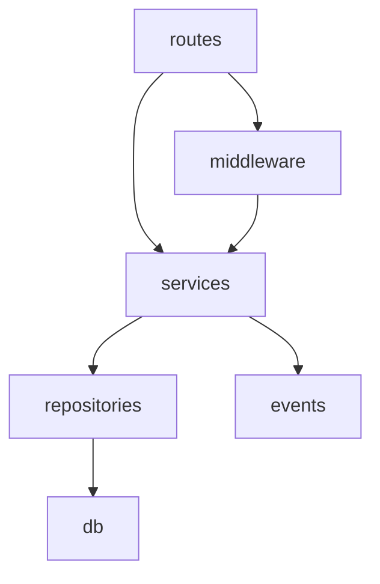

# Ingestion Phase — Prompt Templates & Output Schemas

Phase 1 uses Haiku Engineer (T3) to convert raw source material into structured representations. These are the prompt templates and output formats for each ingestion type.

## General Ingestion Prompt Structure

Every ingestion prompt follows this template:

```
AGENT: Haiku Engineer

YOUR TASK: Read the specified files and produce a structured inventory.
Do NOT make any changes. Do NOT make design decisions. ONLY document what exists.

FILES TO READ:
- [file path 1]
- [file path 2]
- ...

OUTPUT FORMAT: [specify exact schema from below]

RULES:
- Include ONLY what is specified in the output format
- Use the exact field names shown
- Mark anything unclear as [AMBIGUOUS: reason]
- Do NOT include function bodies — only signatures and relationships
- Do NOT suggest improvements or changes
```

## Output Schemas by Task Type

### Interface Inventory (for migrations, lift-and-shift)

```markdown
## Module: [file path]

### Exports

| Name        | Kind   | Signature                             | Used By                             |
| ----------- | ------ | ------------------------------------- | ----------------------------------- | --- |
| UserService | class  | —                                     | routes/users.ts, middleware/auth.ts |
| createUser  | method | (dto: CreateUserDto) => Promise<User> | —                                   |
| findById    | method | (id: string) => Promise<User          | null>                               | —   |

### Dependencies

| Import       | From             | Kind     |
| ------------ | ---------------- | -------- |
| Database     | ../db/connection | class    |
| hashPassword | ../utils/crypto  | function |
| UserDto      | ../types/user    | type     |

### Side Effects

- Writes to `users` table
- Emits `user.created` event
- Sends welcome email via EmailService

### Notes

- [AMBIGUOUS: Error handling inconsistent — some methods throw, others return null]
```

### Call Graph (for understanding execution flow)

```markdown
## Entry Point: POST /api/users
```

routes/users.ts:createUser
→ middleware/auth.ts:requireAdmin
→ validators/user.ts:validateCreateUser
→ services/user.ts:UserService.createUser
→ db/connection.ts:Database.transaction
→ repositories/user.ts:UserRepository.insert
→ repositories/user.ts:UserRepository.findByEmail (duplicate check)
→ services/email.ts:EmailService.sendWelcome
→ events/publisher.ts:publish('user.created')
← returns { user: User, token: string }

```

### Error Paths
- `validateCreateUser` throws ValidationError → 400
- `findByEmail` returns existing → ConflictError → 409
- `Database.transaction` rollback → 500
```

### Dependency Map (for refactoring, understanding coupling)

````markdown
## Dependency Map

### High-Level Module Dependencies


````

### File-Level Dependencies (sorted by fan-out)

| File             | Imports From | Imported By | Fan-Out | Fan-In |
| ---------------- | ------------ | ----------- | ------- | ------ |
| services/user.ts | 5 modules    | 3 files     | 5       | 3      |
| db/connection.ts | 1 module     | 8 files     | 1       | 8      |
| types/user.ts    | 0 modules    | 12 files    | 0       | 12     |

### Circular Dependencies

- NONE (or list them)

### Coupling Hotspots

- `services/user.ts` has highest combined fan-out + fan-in (8)

````

### Function Inventory (for test coverage planning)

```markdown
## File: services/user.ts

### Functions
| Name | Params | Return | Pure | Side Effects | Complexity |
|------|--------|--------|------|-------------|------------|
| createUser | (dto: CreateUserDto) | Promise<User> | No | DB write, email, event | High |
| findById | (id: string) | Promise<User \| null> | No | DB read | Low |
| updateProfile | (id: string, data: Partial<Profile>) | Promise<User> | No | DB write | Medium |
| validateEmail | (email: string) | boolean | Yes | None | Low |

### Edge Cases to Test
- createUser: duplicate email, invalid dto fields, DB transaction failure, email service down
- findById: non-existent ID, deleted user
- updateProfile: partial update, no-op update, concurrent modification
- validateEmail: empty string, unicode, max length
````

### Relevant File Summary (for feature planning)

```markdown
## File: src/api/orders.ts

**Purpose**: Order route handlers (REST CRUD + status transitions)
**Lines**: 245
**Key patterns**:

- Uses `fastify.authenticate` preHandler for all routes
- Validates with Zod schemas from `src/schemas/order.ts`
- Returns consistent `{ data, meta }` response shape
- Error handling via `fastify.errorHandler` (no try/catch in routes)

**Integration points**:

- Calls `OrderService.create()`, `.findById()`, `.updateStatus()`
- Emits `order.created` and `order.status-changed` events
- Requires `admin` role for DELETE

**Relevant types**:

- CreateOrderDto: { items: OrderItem[], shippingAddress: Address }
- OrderResponse: { id, status, items, total, createdAt }
- OrderStatus: 'pending' | 'confirmed' | 'shipped' | 'delivered' | 'cancelled'
```

## Parallelization Strategy

### By File (most common)

```
Dispatch N parallel Haiku ingestion tasks:
- Task 1: Ingest src/services/user.ts → interface inventory
- Task 2: Ingest src/services/order.ts → interface inventory
- Task 3: Ingest src/services/payment.ts → interface inventory
...
```

### By Module (for large systems)

```
Dispatch per-module:
- Task 1: Ingest all files in src/services/ → module summary
- Task 2: Ingest all files in src/api/ → route inventory
- Task 3: Ingest all files in src/db/ → schema + repository inventory
```

### By Concern (for cross-cutting analysis)

```
Dispatch per-concern:
- Task 1: Read all route files → produce call graph for each endpoint
- Task 2: Read all service files → produce dependency map
- Task 3: Read all test files → produce coverage inventory
```

## Ingestion Sizing Rules

| Codebase Size | Ingestion Strategy               | Parallel Tasks |
| ------------- | -------------------------------- | -------------- |
| 1–5 files     | Single ingestion task (read all) | 1              |
| 5–20 files    | Per-file parallel                | 5–20           |
| 20–50 files   | Per-module parallel              | 3–8 modules    |
| 50+ files     | Per-module with sub-batching     | Hierarchical   |

**Rule of thumb**: Each ingestion task should read ≤ 10 files. If a module has more, split by sub-concern.
